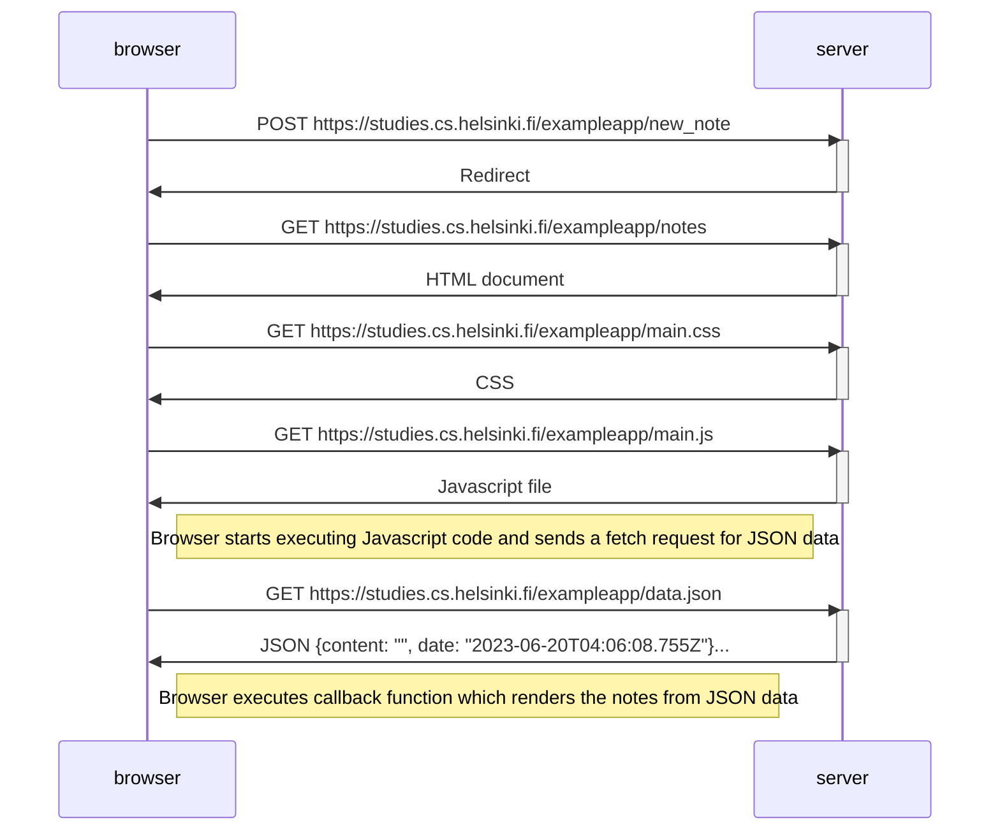

# Page Load

```mermaid
sequenceDiagram
    participant browser
    participant server

    browser->>server: POST https://studies.cs.helsinki.fi/exampleapp/new_note
    activate server
    server->>browser: Redirect
    deactivate server

    browser->>server: GET https://studies.cs.helsinki.fi/exampleapp/notes
    activate server
    server->>browser: HTML document
    deactivate server


    browser->>server: GET https://studies.cs.helsinki.fi/exampleapp/main.css
    activate server
    server->>browser: CSS
    deactivate server

    browser->>server: GET https://studies.cs.helsinki.fi/exampleapp/main.js
    activate server
    server->>browser: Javascript file
    deactivate server

    Note right of browser: Browser starts executing Javascript code and sends a fetch request for JSON data

    browser->>server: GET https://studies.cs.helsinki.fi/exampleapp/data.json
    activate server
    server->>browser: JSON {content: "", date: "2023-06-20T04:06:08.755Z"}...
    deactivate server

    Note right of browser: Browser executes callback function which renders the notes from JSON data
```
